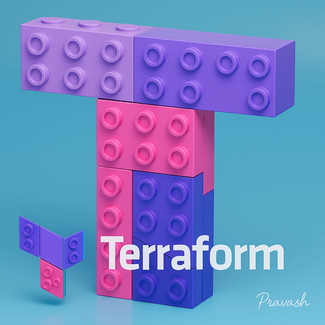

# 03-Terraform-AWS---Bootstrap-Remote-Backend-S3-DynamoDB


## Objective
In this lab, I'll bootstrap (set up) the necessary AWS resources —
S3 bucket (to store Terraform state file) and
DynamoDB table (to lock the state file and avoid conflicts).

- This ensures safe collaboration in real-world teams.
- No need to manually create S3 or DynamoDB anymore!

## Pre-requisites

- Terraform installed
- AWS CLI configured
- IAM User/Role with permissions for:
    - S3 Full Access
    - DynamoDB Full Access


## Folder Structure
```
03-Terraform-AWS---Bootstrap-Remote-Backend-S3-DynamoDB/
├── main.tf
├── variables.tf
├── outputs.tf
├── terraform.tfvars
└── README.md
```

## Step 1: Files to Create

```
touch main.tf variables.tf outputs.tf terraform.tfvars 
```

## 1. `variables.tf` 
```
variable "aws_region" {
    description = "AWS Region for resources"
    type = string
    default = "us-east-1"
}

variable "bucket_name" {
    description = "Name of the S3 bucket to create"
    type = string
}

variable "dynamodb_table_name" {
    description = "Name of the DynamoDB table to create for state locking"
    type = string
}
```
> **WHAT & WHY**
> - `bucket_name` → lets us specify the S3 bucket name where Terraform state files will be stored.
> - **No default provided** → must be passed in (otherwise Terraform will throw an error)
> - `dynamodb_table_name` → lets us define the name of the DynamoDB table that Terraform will use for locking the state.
> - **No default provided** → must also be passed in
> - This separation gives flexibility — we can reuse the same Terraform code but deploy to different environments by just changing variable values.

## 2. `terraform.tfvars`
This file **assigns values** to the variables declared in the `variables.tf`.
Terraform will automatically load this file during `terraform plan` or `terraform apply` if it exists.
```
aws_region = "us-east-1"
bucket_name = "terraform-bootstrap-pro-lab"
dynamodb_table_name = "terraform-lock-pro-lab"
```
> **WHAT & WHY**
> - It overrides or provides required values for `bucket_name` and `dynamodb_table_name` (since they have no defaults).
> - It explicitly sets the region, even though there’s already a default (optional here, but makes things clearer).
> - You can think of this as a configuration file, where you change only the values you want without modifying the .tf files.

## 3. `main.tf`
This is our **core Terraform script** where we will declare what resources to create.

```
provider "aws" {
  region = var.aws_region
}

# Create S3 Bucket for storing terraform state
resource "aws_s3_bucket" "terraform_state" {
  bucket = var.bucket_name

  tags = {
    Name        = "TerraformStateBucket"
    Environment = "Dev"
  }
}

# Enable versioning on the S3 Bucket
resource "aws_s3_bucket_versioning" "terraform_state_versioning" {
  bucket = aws_s3_bucket.terraform_state.id

  versioning_configuration {
    status = "Enabled"
  }
}

# Create DynamoDB table for state locking
resource "aws_dynamodb_table" "terraform_locks" {
  name         = var.dynamodb_table_name
  billing_mode = "PAY_PER_REQUEST"
  hash_key     = "LockID"

  attribute {
    name = "LockID"
    type = "S"
  }

  tags = {
    Name        = "TerraformStateLock"
    Environment = "Dev"
  }
}
```

> **WHAT & WHY**
> - **Provider block** → tells Terraform which cloud provider you’re using (AWS here) and which region to connect to (pulled from the variable).
> - **S3 bucket** → creates a bucket (with the name from the variable) that will store the Terraform state file.
> - **Bucket versioning** → enables versioning on the bucket so that old state files are kept, preventing accidental overwrites or losses.
> - **DynamoDB table** → creates a table to store state lock information. Terraform uses this to prevent multiple people from applying changes at the same time (avoiding state corruption).

## 4. `output.tf`
```
output "s3_bucket_name" {
  description = "Name of the created S3 bucket"
  value       = aws_s3_bucket.terraform_state.id
}

output "dynamodb_table_name" {
  description = "Name of the created DynamoDB table"
  value       = aws_dynamodb_table.terraform_locks.name
}
```
> **WHAT & WHY**
> - `s3_bucket_name` → prints the bucket name once created.
> - `dynamodb_table_name` → similarly, prints out the DynamoDB table name.

## STEP 2: Commands to Run

1. Initialize Terraform:
```terraform init```

2. Validate the files:
```terraform validate```

3. Terraform Plan:
```terraform plan -out=tfplan```

4. Terraform Apply:
```terraform apply "tfplan"```


## After Apply

Login to AWS Account and we can see:

**1. A new S3 Bucket with versioning enabled.**


**2. A new DynamoDB table ready to lock Terraform states.**


## FINALLY
Now, let's come to the reason for which we did this ****Bootstrap** Lab
The sole pupose of doing this lab is:
> - No Manual Cration of S3/DynamoDB needed anymore.
> - One-time bootstrap, use forever!

## How to Use this bootstrapped S3/DynamoDB in any project?
Ans: We can use this using a `backend.tf` file:
```
terraform {
  backend "s3" {
    bucket         = "terraform-bootstrap-pro-lab"
    key            = "path/to/myproject/terraform.tfstate"
    region         = "us-east-1"
    dynamodb_table = "terraform-lock-pro-lab"
    encrypt        = true
  }
}
```

## WHAT'S NEXT?

**In our next lab, we will:**
> - Configure Terraform to store the state file in a remote S3 bucket.
> - Enable state locking using DynamoDB.
> - Perform Terraform operations using this secure remote backend.

---
> Prepared By: Pravash

> Last Updated: May 2025